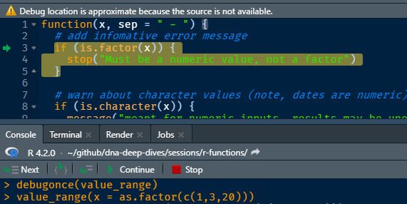
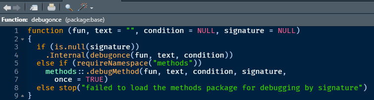

```{r opts, include=FALSE}
knitr::opts_chunk$set(
  fig.width = 9, fig.height = 3.5, fig.retina = 3,
  out.width = "100%",
  comment = "",
  message = FALSE,
  warning = FALSE,
  error = TRUE
)
```


See [here](https://www.github.com/pages/rjake/analytics-deep-dive/sessions/r-functions/slides.html#1) 
for slides and [here](https://www.github.com/rjake/analytics-deep-dive/blob/main/sessions/r-functions/index.Rmd) for the raw code

```{r workspace}
library(tidyverse)
library(glue)
library(lubridate)
library(gt)
library(rlang)
```

## Writing functions

### A simple function

This will return a phrase such as "1 - 10" or "18 to 21"

```{r}
format_range <- function(x, sep = " - ") {
  range(x, na.rm = TRUE) |> 
    paste(collapse = sep)
}
```

I could also have also used this logic:

```{r, eval=FALSE}
paste(
  min(x, na.rm = TRUE), sep, max(x, na.rm = TRUE)
)

```

Let's look at some outputs

```{r input-orig, echo=FALSE}
gt_table <- function(df, sz = pct(90), ...) {
  gt(df) |>
    tab_options(table.font.size = sz) |> 
    tab_style(
      style = 
        "padding-right:8px;
         padding-left: 8px;
         padding-bottom:5px;
         padding-top:   5px;",
      locations = list(cells_body(), cells_column_labels())
    )
}

# * input_test ----
#rand_numbers <- rnorm(100)

input_test <- rlang::exprs(
  format_range(1:10),
  format_range(10:1),
  format_range(1:10, sep = " up to "),
  format_range(1),
  format_range(-1:1, sep = " ... "),
  #format_range(round(rand_numbers, 3)),
  format_range(Sys.Date() + 0:10),
  format_range(letters)
)

old_value_output <- 
  tibble(
    test = as_glue(input_test),# |> str_replace("rand_numbers", "rnorm(100)"),
    output = 
      map(input_test, rlang::eval_tidy) |> 
      as_glue()
  )

old_value_output |> 
  gt_table() |>
  tab_style(
    style = cell_text(font = "Courier"),
    locations = cells_body(columns = test)
  ) |> 
  #opt_table_font("Courier") |>
  cols_align("left", test)
```


**It's not perfect** 

* "1 - 1" should just return "1"
* Dates could be formatted better

**It also throws an error on factors**

* The user doesn't know where `'range'` is coming from

    ```{r}
    format_range(as.factor(letters))
    ```


### Alerts & errors

* There are 3 levels of alerts

    ```{r}
    message("I'll let you know but won't stop you")
    
    warning("ok... but are you sure?")
    
    stop("sorry pal, not going to happen :(", call. = FALSE)
    ```
    
* Use messages when possible
* Try to help the user figure out what went wrong


### Revised function

Let's update our function to be more informative

```{r}
format_range <- function(x, sep = " - ") {
  # add infomative error message
  if (is.factor(x)) {
    stop("Works with numbers and dates but not factors")
  }
  
  # warn about character values c(1, 3, 20) will return 3 as max not 20
  if (is.character(x)) {
    message("meant for numeric inputs, results may be unexpected")
  }
  
  # early return if a single value
  if (length(unique(x)) == 1) {
    return(paste(x, "only"))
  }
  
  res <- range(x, na.rm = TRUE)
  
  if (is.Date(res) | is.POSIXct(res)) {
    res <- format(res, "%B%e, %Y") # June 1, 2022
  }
  
  paste(res, collapse = sep)
}
```


```{r input-new, echo=FALSE}
old_value_output |> 
  rename(orig = output) |> 
  left_join(
    tibble(
      test = as_glue(input_test),
      new = 
        map(input_test, rlang::eval_tidy) |> 
        as_glue()
    )
  ) |> 
  gt_table() |>
  tab_style(
    style = cell_text(font = "Courier"),
    locations = cells_body(columns = c(1))
  ) |> 
  cols_align("left", test) |>
  tab_style(
    style = list(
      cell_fill(color = "lightcyan"),
      cell_text(style = "italic")
    ),
    locations = cells_body(
      columns = c(orig, new),
      rows = str_detect(new, "only|\\d{4}")
    )
  )
```

### Document with `roxygen` syntax

Put cursor on function then use `Code > Insert Roxygen Skeleton` 

* Uses `#'` and `#' @` as documentation
* Used heavily in package development
* At a minimum, include a title (top line) and `@examples`

```{r, eval=FALSE}
#' Returns the min & max values as a concatenated value
#' @param x a vector that is not a factor
#' @param sep the text to put between min(x) and max(x)
#' 
#' @examples
#' format_range(x = 1:10)
#' format_range(x = 1:10, sep = " through ")
#' format_range(x = economics$date, sep = " to ")
format_range <- function(x, sep = " - ") {
  range(x, na.rm = TRUE) |> 
    paste(collapse = sep)
}
```


## Debugging

### Functions you wrote
Sometimes I'll add helper vars in the comments, especially for tidy evaluation (up next)
```{r helper-vars}
format_range <- function(x, sep = " - ") {
  # x <- 1:10; sep <- "-"
  ...
}
```

**`debugonce()`** will turn on an interactive debugger. This can really help!

```{r debugonce, eval=FALSE}
debugonce(format_range)

format_range(x = as.factor(c(1,3,20)))
# try changing x to a character once the debugger is open
```



Note the buttons for Next, Into, Execute Remaining, Continue, and Stop

You can also add `browser()` inside your function to look around

```{r browser, eval=FALSE}
with_browser <- function(x, sep = " - ") {
  res <- range(x, na.rm = TRUE)
  
  browser()                  # <------- here
  paste(res, sep = sep)
}

with_browser(x = 1:10)
# I need 'collapse', not 'sep'
```

### Functions other people wrote
You can also see how functions are created by calling them without `()`

```{r}
forcats::fct_rev
```

Note, sometimes you'll see `UseMethod()`. You can access the code using `pkg:::fn` but methods are a special way to write functions and out of scope for today.

```{r}
dplyr::filter
dplyr:::filter.data.frame
```

### F2
F2 will let you "browse" any function. Note: you must have the package loaded or the function in your environment




## Tidyeval
[lookup table](#tidyeval-lookup)

**What's nice about functions in the `tidyverse` is that**

* you can pass column names without brackets or dollar signs
* they are also less verbose
* generally more consistent method

```{r, eval=FALSE}
# base R
mtcars$mpg[mtcars$mpg > 30 & mtcars$hp > 60]
#     ----

mtcars[mtcars$mpg > 30 & mtcars$hp > 60, "mpg"]
#                                      -------
subset(mtcars, mpg > 30 & hp > 60)$mpg
#                                 ----
```

```{r, eval=FALSE}
# tidyverse
mtcars |> 
  filter(between(mpg, 30, 60)) |> 
  pull(mpg)
```

**Unfortunately**

* they're more complicated under the hood as the data frame is its own environment
  
* very hard (frustrating) to debug

---

### New Operators
#### `{{x}}` curly-curly 
**In general**

* you'll need to use **`{{x}}`**, called "curly-curly" or "embrace"
* you can often mock it up with `as.symbol("string")` or `quo(expr)`

```{r}
col_mean <- function(df, col) {
  # df <- mpg; col <- as.symbol("cty")
  df |> 
    summarise(
      mean = mean({{col}}, na.rm = TRUE)
    )
}

airquality |> 
  group_by(Month) |>
  col_mean(Wind)

airquality |> 
  group_by(Month) |>
  col_mean(Ozone)
```

---

#### `:=` the walrus 
* You can dynamically affect the column names (left hand side) with the walrus operator `:=`
* You can add text by putting the embrace in quotes `"{{x}}_more_stuff"`
```{r}
col_difference <- function(df, x, y) {
  # df <- mpg; x = as.symbol("cty"); y = as.symbol("hwy")
  df |> 
    summarise(
      {{x}} := mean({{x}}),
      {{y}} := mean({{y}})
    ) |> 
    mutate(
      "avg_{{x}}_to_{{y}}" := {{x}} - {{y}}
    )
}
```

Let's try it out
```{r}
mpg |> 
  group_by(class) |> 
  col_difference(
    x = hwy, 
    y = cty
  )
```

### Examples
#### Making a plot

You can use `{{x}}` in ggplot itself
```{r}
make_plot <- function(df, date, n, ...) {
  
  #               --------  -----
  ggplot(df, aes(x =  {{date}}, y = {{n}} )) +
    geom_point(...) +
    theme_minimal()
}

```

Let's see
```{r}
make_plot(
  economics,
  date = date,
  n = unemploy
) 
```

Because the output of `make_plot()` is a ggplot object, I can pipe on more steps with `+`

I can also adjust the look by filling in the `...`
```{r}
make_plot(
  economics,
  date = date,
  n = unemploy,
  # passed via ...
  size = 1, 
  color = "orange"
) +
  geom_line()
```

#### "Hard-coding"
Sometimes I hard code the variables I need so I don't need `{{x}}` each time

* use `mutate()` or `transmute()` to give the columns static names
* use `rlang` functions `as_string(ensym(...))` outside of data frames to return a string

```{r}
make_plot_and_title <- function(df, date, n, ...) {
  plot_title <- paste( as_string(ensym(n)), "by", as_string(ensym(date))) 
  
  df |> 
    mutate(
      x = {{date}},       # <-----
      y = {{n}}           # <-----
    ) |> 
    ggplot(aes(x, y)) +
    geom_line(color = "grey90", size = 2) +
    geom_point(...) +
    theme_minimal() +
    labs(
      title = str_to_title(plot_title),
      x = NULL, 
      y = NULL
    )
}
```

Let's try it out

```{r}
economics |> 
  # rename columns
  transmute(
    unemployment = unemploy * 1e3,
    month = date
  ) |> 
  # new function
  make_plot_and_title(
    date = month,
    n = unemployment,
    # passed to ...
    mapping = aes(color = unemployment > 7.5e6),
    size = 2
  ) + 
  scale_color_manual(values = c("grey75", "darkred")) +
  theme(legend.position = "none") +
  labs(subtitle = "The color change represents the 7.5M mark")
```

### Getting more complicated

When things get more complicated, I almost always leave in helpers

```{r}
#' Rollup data using summarise(across(...))
#'
#' @param name prefix for
#' @param cond the x or y condition used in compare_conditions()
#' @examples
#' aggregate_group(df = mtcars, cond = mpg > 30, cols = mpg, fns = lst(mean, sd))
aggregate_group <- function(df, 
                            cond, 
                            cols = where(is.numeric), 
                            fns = lst(mean)) {
  # df <- mtcars; cond <- dplyr::quo(cyl > 4);
  # cols <- dplyr::quo(mpg); fns <- dplyr::lst(mean); 

  df |>
    filter({{cond}}) |>
    summarise(
      across({{cols}}, fns, .names = "{.fn}_{.col}")
    )
}
```

Let's try it out

```{r}
mtcars |> 
  aggregate_group(cond = mpg > 30) 
```

This function seems pretty robust

```{r}
mpg |> 
  group_by(class) |> 
  aggregate_group(
    cond = (cyl == 4 & year == 2008), 
    cols = c(drv, model),
    fns = list(
      dist = n_distinct, 
      min = min, 
      max = max,
      dig = ~sum(str_count(.x, "\\d"))
    )
  )
```

### Mock inputs (lookup table) {#tidyeval-lookup}

* `quo()` will pass an expression like `cty > 18` or a symbol (name of an object) like `cty`, these aren't evaluated until they are called in the data frame
* `as.symbol()` only takes a single variable `as.symbol("cty")`

```{r lookup-table, echo=FALSE}
list(
  list(#1
    "cty",      "symbol",     "column",    "df",  'x <- quo(cty) <br> x <- as.symbol("cty")',
    "select({{x}}) <br> 
    mutate(test = {{x}})"
  ),
  list(#2
    'cty',      "symbol",     "string",    "env",  'x <- as.symbol("cty")',
    "mutate(test = as_string(ensym(x))) <br>
    p + labs(title = as_string(ensym(x)))"
  ),
  list(#3
    '"cty"',    "string",     "column",    "df",  'x <- "cty"',
    "select(x) <br>
    mutate(test = get(x) > 18)"
  ),
  list(#4
    "cty > 18", "expression", "condition", "df",  "x <- quo(cty > 18)", 
    "filter({{x}}) <br>
    mutate(test = {{x}})"
  )
) |> 
  map(
    set_names, 
    c("value of x", "x is", "need", "in", "mock-up for debugging", "how to use")
  ) |> 
  map_dfr(as_tibble) |> 
  relocate(`how to use`, .after = `in`) |> 
  mutate(`how to use` = str_replace_all(`how to use`, "x", "**x**")) |> 
  gt_table() |> 
  fmt_markdown(columns = everything()) |> 
  cols_align("center", columns = 1:4) |> 
  tab_style(
    style = cell_text(font = "Courier"),
    locations = cells_body(columns = c(1, 5, 6))
  ) |>
  tab_style(
    style = cell_text(weight = "bold", align = "center"),
    locations = cells_body(columns = 1)
  ) |> 
  cols_width(
    1 ~ px(120), 
    5 ~ px(350)
  ) |> 
  opt_row_striping()

```

---

An example trying them all out

```{r}
library(rlang)
rlang_test <- function(df, symbol, string) {
  list(
    column_from_symbol = 
      mutate(df, "{{symbol}}_kph" := {{symbol}} * 1.6) |> 
      slice(1),
    
    column_from_string = 
      mutate(df, use_col = get(string)) |> 
      slice(1),
    
    symbol_to_string_df = 
      tibble(use_value = as_string(ensym(symbol))),
    
    symbol_to_string_env = 
      paste("var =", as_string(ensym(symbol)))
  )
}
```

Let's see if we get:

* **Wind_kph** = **11.84**
* use_col = **7.4**
* use_value = **Wind**
* var = **Wind**

```{r}
# debugonce(rlang_test)
rlang_test(
  df = airquality, 
  symbol = Wind, 
  string = "Wind"
)

```

## Environments

Be mindful of where you ask a function to look for object names

R will look for variables in this order

order|location                  |example
:--- | :---                     | :---
 1st | **data**                 | `mtcars$mpg`
 2nd | **function environment** | `mpg <- 2`
 3rd | **function arguments**   | `mpg <- 3`
 4th | **global environment**   | `mpg <- 4`


```{r, eval=FALSE}
mpg <- 4                           # 4

add_kph <- function(df, mpg = 3) { # 3
  mpg <- 2                         # 2
  
  df |>                            # 1
    mutate(kph = mpg * 1.6) |>
    as_tibble()
}
```

```{r, eval=FALSE}
# would use mtcars$mpg
add_kph(mtcars)

# if not in data would use env 'mpg <- 2'
add_kph(airquality)

# if comment out 'mpg <- 2' will use default argument 'mpg = 3'
add_kph(airquality)

# if argument is supplied, will use 'mpg = 20'
add_kph(airquality, mpg = 20)

# if all the above is removed, it will look in the global env 'mpg <- 4'
add_kph(airquality)

```
