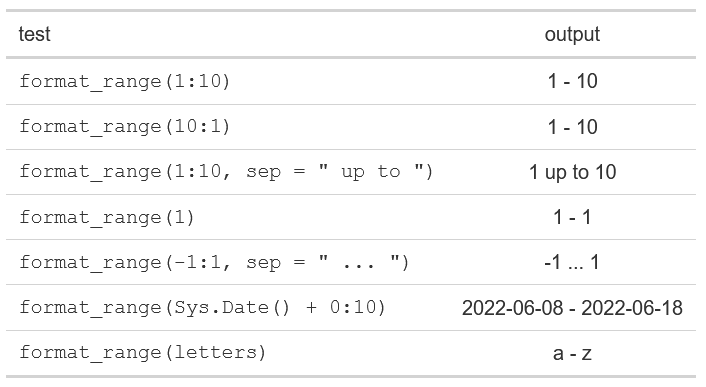
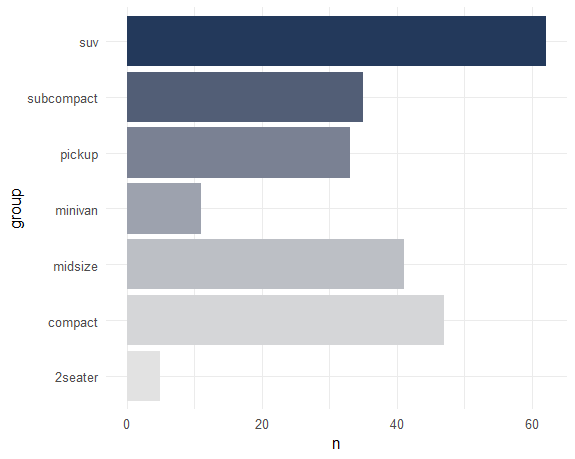

```{r xaringan-themer, eval=FALSE, include=FALSE, warning=FALSE}
# run as needed
library(xaringanthemer)
style_mono_light(
  table_row_even_background_color = "transparent",
  base_font_size = "13px",
  # code_inline_color = "black",
  # code_font_size = "0.7rem",
  # code_inline_font_size = "0.7rem",
  # code_inline_background_color = "#f8f8f8",
  header_background_padding = "0px",
  header_background_content_padding_top = "0px",
  link_decoration = "underline"
)

```

```{css css-style, echo=FALSE}
.title-slide {
  vertical-align: bottom !important; 
  text-align: left !important;
}

.small {
  font-size: 80%;
}

.large {
  font-size: 130%;
}

```


```{r setup, include=FALSE}
options(htmltools.dir.version = FALSE)
knitr::opts_chunk$set(
  fig.width = 9, fig.height = 3.5, fig.retina = 3,
  out.width = "100%",
  #cache = FALSE,
  #echo = TRUE,
  comment = "",
  eval = FALSE,
  message = FALSE,
  warning = FALSE,
  error = TRUE,
  hiline = TRUE
)

library(tidyverse)
library(glue)
library(flair)
library(simplecolors) # colors called with sc(...)
library(gt)

registerS3method(
  "knit_print", "with_flair", knit_print.with_flair,
  envir = asNamespace("knitr")
)


highlight_colors <- 
  simplecolors::sc_across(
    light = 1, 
    #sat = "muted",
    return = "table"
  )

decorate <- partial(flair::decorate, eval = FALSE)

hl <- 
  set_names(
    highlight_colors$hex,
    str_remove(highlight_colors$color_name, "muted|\\d")
  ) |> 
  as.list()

```

# Agenda

.large[
### Intro
* When & Why

* Basics of a function

<br>

### Deep Dive
* Live session - [code](https://www.github.com/rjake/analytics-deep-dive/blob/main/sessions/r-functions/index.Rmd) | [html](https://rjake.github.io/analytics-deep-dive//sessions/r-functions/)
  
  * debugging
  
  * documentation
  
  * tidyeval
  
* Best practices
]

---

## DRY - Don't Repeat Yourself

.pull-left[
Same code (mostly) repeated
```{r range-no-fn, echo=FALSE}
pop_range <- 
  range(economics$pop, na.rm = TRUE) |> 
  paste(collapse = " - ")
#> "198712 - 320402"


unemp_range <- 
  range(economics$unemploy, na.rm = TRUE) |> 
  paste(collapse = " - ")
#> "2685 - 15352"


savings_range <- 
  range(economics$psavert, na.rm = TRUE) |> 
  paste(collapse = " - ")
#> "2.2 - 17.3"


date_range <- 
  range(economics$date, na.rm = TRUE) |> 
  paste(collapse = " to ")
#> "1967-07-01 to 2015-04-01"

```

```{r, echo=FALSE, eval=TRUE}
decorate("range-no-fn") |> 
  flair_funs(background = hl$teal) |> 
  #flair_rx("(?<=\\$)\\w+") |> 
  flair_rx('collapse = [^\\)]+', background = hl$green) |> 
  flair_rx("na.rm = TRUE", background = hl$pink) |> 
  flair_rx("#.*", color = sc("grey3"))
```
]

.pull-right[
... as a function
```{r eval=TRUE, echo=FALSE}
fn_anatomy <- as_glue(
'format_range <- function(x, sep = " - ") {
   range(x, na.rm = TRUE) |> 
     paste(collapse = sep)
}')

eval(parse(text = fn_anatomy))
```

```{r range-with-fn, echo=FALSE}
format_range <- function(x, sep = " - ") {
  range(x, na.rm = TRUE) |> 
    paste(collapse = sep)
}

pop_range <- format_range(economics$pop)

unemp_range <- format_range(economics$unemploy)

savings_range <- format_range(economics$psavert)

date_range <- format_range(economics$date, sep = " to ")
```

```{r, echo=FALSE, eval=TRUE}
decorate("range-with-fn") |> 
  #flair_rx("(?<=\\$)\\w+") |>
  flair("format_range", background = hl$blue) |> 
  flair_rx("\\b(range|paste)", background = hl$teal) |> 
  flair_rx('collapse = [^\\)]+|sep( = ".*")?', background = hl$green) |> 
  flair_rx("na.rm = TRUE", background = hl$pink) |> 
  flair_rx("#.*", color = sc("grey3"))

```

**Why?**
* only write in **one place**
* only fix in   **one place**

**When?**
* Doing **3x** or **5+ lines x 2**
]

---

# You may have used {...} in a loop or in shiny

If you're using `{...}` at all, it's pretty easy to translate the contents to a function

.pull-left[
```{r, echo=FALSE, eval=TRUE}
decorate(
  as_glue('
for (dept in unique(cohort$department_name)) {
  df <- 
    cohort |>
    filter(department_name == dept)
  
  title <- glue("{dept} had {nrow(df)} visits")
  
  ggplot(df, aes(month)) +
    geom_bar() +
    labs(title = title)
}
')
) |> 
  flair("dept")
```

```{r, echo=FALSE, eval=TRUE}
decorate(
  as_glue('
renderPlot({
  df <-
    cohort |>
    filter(department_name == input$dept)

  title <-
    glue("{dept} had {nrow(df)} visits")

  ggplot(df, aes(month)) +
    geom_bar() +
    labs(title = title)
})
')
) |> 
  flair("input$dept")
```
]

.pull-right[
```{r, echo=FALSE, eval=TRUE}
decorate(as_glue(
'plot_dept <- function(dept) {
  df <- 
    cohort |>
    filter(department_name == dept)
  
  title <- glue("{dept} had {nrow(df)} visits")
  
  ggplot(df, aes(month)) +
    geom_bar() +
    labs(title = title)
}')
) |> 
  flair_rx("(?<=[^_])dept")
```

```{r echo=FALSE, eval=TRUE}
as_glue(
'map(
  .x = unique(cohort$department_name), 
  .f = plot_dept
)'
) |> 
  decorate() |> 
  flair("plot_dept")


as_glue(
"renderPlot({
   plot_dept(input$dept)
})"
) |> 
  decorate() |> 
  flair("plot_dept")
```
]

---

# Terminology

.pull-left[
### Parameters


```{r, echo=FALSE, eval=TRUE}
decorate(fn_anatomy) |> 
  flair_rx('(?<=function.)x|sep(?=\\s)')
```

`x` and `sep` are **parameters** (what you write)

* `x` always needs to be passed

* `sep = " - "` is a **default** argument and only needs to be passed when different

<br>

### Arguments
```{r, echo=FALSE, eval=TRUE}
decorate('format_range(x = 1:10, sep = " to ")') |> 
  flair_input_vals()
```

`x = 1:10` and `sep = " to "` are **arguments** (what the user enters)

]

.pull-right[
### Body 

What happens to the values supplied, uses `{...}`

```{r, echo=FALSE, eval=TRUE}
decorate(fn_anatomy) |> 
  flair_rx("(range|paste)\\(.*")
```

* Note: `na.rm` is always `TRUE`


]

---


# Using the ellipsis - `fn(...)`
.pull-left[
```{r, eval=TRUE}
library(scales)

nice_number <- function(x, ...) {
  scales::comma(
    x,
    ...,
    scale_cut = cut_short_scale()
  )
}
```

```{r, eval=TRUE}
nice_number(12345)

nice_number(12345, accuracy = 0.1)
```

The `...` only exists inside the function, you can't call use it like this
```{r}
nice_number(12345, ...)
```
]

.pull-right[
```{r, eval=TRUE}
tibble(
  x = c(1234^(1:4)),
  custom = 
    nice_number(
      x, 
      accuracy = 0.1, 
      prefix = "$",
      suffix = " USD"
    )
) |> 
  gt()
```
]

---

class: center, middle

# Debugging - live demo
.large[
[code](https://www.github.com/rjake/analytics-deep-dive/blob/main/sessions/r-functions/index.Rmd) | [html](https://rjake.github.io/analytics-deep-dive//sessions/r-functions/)
]

---

class: center, middle

# Best Practices


---

# Style

.pull-left[
### Informative names

* longer rather than shorter

* verbs / actions rather than nouns
    * note: boolean functions usually starts `is_*()`

* not conflict with nearby packages / base R functions

* snake_case

<br>

| Not Great       | Better            |
| ---             | ---               |
| `f`, `f2`, `g`  | `compare_rows`    |
| `data`          | `read_mu_api`     |
| `my_data`       | `scrub_data`      |
| `row_adder`     | `add_row`         |
| `permutation`   | `permute`         |
| `getCDWResults` | `get_cdw_results` |
| `nth.char`      | `return_nth_char` |

<br>

_* from the tidyverse [style guide](https://style.tidyverse.org/functions.html) for functions_

]

.pull-right[

### Comments 

* Should describe **why** the step is needed **not what or how**

* For this function
  - `map_if(x, is_bare_list, recurse)`

* This would be a good comment
  - `# Objects like data frames are treated as leaves`

* Instead of 
  - `# Recurse only with bare lists`


### Indentation

* Function parameters are indented to align with the end of `function(`

* `) {` goes on the same line as the last argument

* Body is indented


```{r eval=FALSE}
build_provider_contact <- function(full_name,
                                   email,
                                   phone) {
  # logic here, indented 2 spaces
}
```

]

---

# Fewer `if` statements with `switch()`

.pull-left[

`if` logic can be wordy and confusing to navigate (this is a simple example)

```{r}
agg <- function(x, type) {
  if (type == "+") {
    res <- sum(x, na.rm = TRUE)
    
  } else if (type == "*") {
    res <- prod(x, na.rm = TRUE)
    
  } else if (type == "~") {
    res <- mean(x)
  }
  
  return(res)
}
```

]

.pull-right[

`switch()` can return different outputs based on the value supplied

```{r returns-early}
agg <- function(x, type) {
  switch(
    type,
    "+" = sum(x, na.rm = TRUE),
    "*" = prod(x, na.rm = TRUE),
    "~" = mean(x, na.rm = TRUE)
  )
}
```

or

```{r}
agg <- function(x, type) {
  fun <- 
    switch(
      type,
      "+" = sum,
      "*" = prod,
      "~" = mean
    )
  
  fun(x, na.rm = TRUE)
}

```


```{r}
agg(1:4, "+") # 1 + 2 + 3 + 4 = 10
agg(1:4, "*") # 1 * 2 * 3 * 4 = 24
agg(1:4, "~") # sum(1:4) / 4  = 2.5
```

]

---
# Early returns

```{r fn-plot-groups, eval=TRUE, echo=FALSE}
plot_groups <- function(df, return_data = FALSE, min_max = FALSE) {
  prep_df <- 
    count(df) |> 
    ungroup()
  
  if (return_data == TRUE) {
    res <- prep_df
  } else if (min_max == TRUE) {
    res <- prep_df |> filter(n %in% range(n))
  } else {
    res <- 
      prep_df |> 
      rename(group = 1) |> 
      ggplot(aes(n, group, fill = group)) +
      geom_col() +
      scale_fill_grey() +
      theme_minimal()
  }
  
  return(res)
    
}
```

.pull-left[
```{r}
mpg |> 
  group_by(class) |> 
  plot_groups()
```


]

.pull-right[
```{r, eval=TRUE}
mpg |> 
  group_by(class) |> 
  plot_groups(return_data = TRUE)

mpg |> 
  group_by(class) |> 
  plot_groups(min_max = TRUE)

```

]

---
# Early returns

.pull-left[

* `return()` not required if it is the last step of the function

```{r ref.label="fn-plot-groups"}
```


]

.pull-right[

* use `return()` to exit the function early

```{r eval=TRUE}
plot_groups <- function(df, return_data = FALSE, min_max = FALSE) {
  prep_df <- 
    count(df) |> 
    ungroup()

  if (min_max) {
    return(filter(prep_df, n %in% range(n))) # <---
  }

  if (return_data) {
    return(prep_df)                          # <---
  }

  prep_df |>
    rename(group = 1) |>
    ggplot(aes(n, group, fill = group)) +
    geom_col() +
    scale_xaringan_fill_discrete() +
    theme_minimal() +
    theme(legend.position = "none")
}
```

**Note:**

* Fewer assignments
* Boolean logic can just be the object 
  * `(return_data == TRUE)` can be 
  * `(return_data)`


]

---

# Next steps

.large[

### If most of this was new

* Start with what you have

* Use F2 to see how other functions work

* Get help through code review or Techknowledge Time

<br>

### If only some of this was new

* Join the `rocqi` team and learn about package development

* Offer to help others with code review

]

### Additional Resources

* [Tidyverse Design Guide](https://design.tidyverse.org/)

* [Tidyverse Style Guide](https://style.tidyverse.org/functions.html)

* [Advanced R](https://adv-r.hadley.nz/functions.html)
