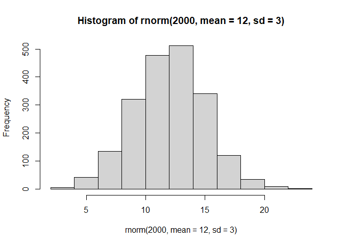
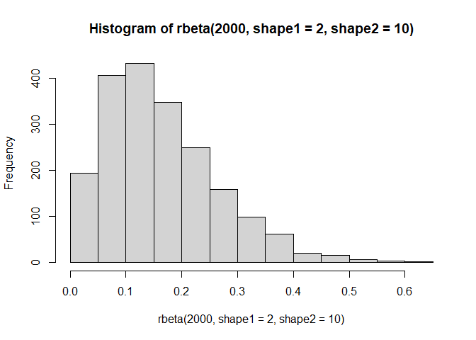

Reproducible Examples in R
================
Jake Riley 3/2/2023

## Agenda

- [slides](https://rjake.github.io/analytics-deep-dive/sessions/reprex-r)
  \|
  [code](https://www.github.com/rjake/analytics-deep-dive/blob/main/sessions/reprex-r/README.md)

- What is a reproducible example

- How to mock up data

- Built in data sets

- Recap

- If time / interest… examples in SQL

<br>

We will use these libraries

``` r
library(tidyverse)
library(rocqi) # internal to CHOP
```

# Reproducible Examples

`reprex` is shorthand for a `rep`roducible `ex`ample <br> It should be
as little code as required for other people to run your code

## Let’s look at an example

<div class="columns">

<div class="column">

Original

``` r
score_percent <- 
  respondents_clean |> 
  count(group, score_raw) |> 
  mutate(perc = n / sum(n)) |> 
  mutate(
    color = case_when(
      score_raw == 0 ~ "A", 
      between(score_raw, 1, 2) ~ "B", 
      TRUE ~ "C"
    ),
    score_raw = factor(score_raw)
  ) |> 
  arrange(score_raw)

ggplot(score_percent, aes("group", perc, fill = color)) +
  geom_bar(color = "black", position = "stack", stat = "identity")
```


</div>

<div class="column">

Reprex

``` r
library(lubridate)
library(tidyverse)

score_percent <-
  tibble(
    score_raw = c(0:4),
    n = c(10, 4:1)
  )

score_percent |> 
  mutate(
    color = case_when(
      score_raw == 0 ~ "A", 
      score_raw <= 2 ~ "B", 
      TRUE ~ "C"
    ) |> 
      fct_reorder(n, sum) # <----
  ) |> 
  ggplot(aes("group", n, fill = color)) +
  geom_col(color = "black", position = "fill") +  # <----
  theme(aspect.ratio = 1.5)
```


</div>

</div>

## Getting help in R

**Pointers**

- use built-in datasets

- `dput()` + `datapasta` to recreate data

- `set.seed()` for random-generating functions

- always include libraries, the `reprex` package can help

# Built-in Data

There are data sets and constants in R that can help you mock up your
code

## Use built-in dates

Use `Sys.time()` and `Sys.Date()`

``` r
tibble(
  date_requested = Sys.time() + (1:6 * 60),
  surgery_date = Sys.Date() + (1:6 * 7),
  date_dist = surgery_date - as.Date(date_requested)
)
```

    # A tibble: 6 × 3
      date_requested      surgery_date date_dist
      <dttm>              <date>       <drtn>   
    1 2023-03-02 13:33:41 2023-03-09    7 days  
    2 2023-03-02 13:34:41 2023-03-16   14 days  
    3 2023-03-02 13:35:41 2023-03-23   21 days  
    4 2023-03-02 13:36:41 2023-03-30   28 days  
    5 2023-03-02 13:37:41 2023-04-06   35 days  
    6 2023-03-02 13:38:41 2023-04-13   42 days  

I like starting with a `tibble()` instead of `data.frame()` since you
can use columns made at the time

## Use built-in `letters`

Note `rep(..., each)` vs `rep(..., times)`

``` r
tibble(
  surgeon = rep(LETTERS[1:3], each = 2),
  location = rep(letters[1:3], times = 2),
  op_note = sentences[1:6] # comes from stringr
)
```

    # A tibble: 6 × 3
      surgeon location op_note                                    
      <chr>   <chr>    <chr>                                      
    1 A       a        The birch canoe slid on the smooth planks. 
    2 A       b        Glue the sheet to the dark blue background.
    3 B       c        It's easy to tell the depth of a well.     
    4 B       a        These days a chicken leg is a rare dish.   
    5 C       b        Rice is often served in round bowls.       
    6 C       c        The juice of lemons makes fine punch.      

## Use `sentences` for regex

This comes from `stringr`

``` r
tibble(
  note_text = sentences[1:5],
  last_word = str_extract(note_text, "\\w+\\.$") # don't want "."
)
```

    # A tibble: 5 × 2
      note_text                                   last_word  
      <chr>                                       <chr>      
    1 The birch canoe slid on the smooth planks.  planks.    
    2 Glue the sheet to the dark blue background. background.
    3 It's easy to tell the depth of a well.      well.      
    4 These days a chicken leg is a rare dish.    dish.      
    5 Rice is often served in round bowls.        bowls.     

## Mock up missing values from scratch

``` r
tibble(
  x = c(1, NA, 2),
  y = c(NA, "a", NA)
)
```

    # A tibble: 3 × 2
          x y    
      <dbl> <chr>
    1     1 <NA> 
    2    NA a    
    3     2 <NA> 

## Mock up missing values using existing data

``` r
head(mtcars) |>
  select(1:5) |>
  mutate_all(# make NA if rows are in 2 or 4
    ~ifelse(row_number() %in% c(2, 4), NA, .x)
  )
```

                       mpg cyl disp  hp drat
    Mazda RX4         21.0   6  160 110 3.90
    Mazda RX4 Wag       NA  NA   NA  NA   NA
    Datsun 710        22.8   4  108  93 3.85
    Hornet 4 Drive      NA  NA   NA  NA   NA
    Hornet Sportabout 18.7   8  360 175 3.15
    Valiant           18.1   6  225 105 2.76

## Use `?fn` to get sharable examples

If you need help with an spc chart, look in the help page

Using `?spc` gives this example:

``` r
spc(
  data = sepsis,
  x = hospital_admit_date,
  y = abx_30_min_ind,
  chart = "p",
  part_dates = "2022-06-01"
)
```

# Random numbers

## Use built-in distribution functions

<div class="columns">

<div class="column">

`rnorm()` gives a normal distribution

``` r
hist(
  rnorm(2000, mean = 12, sd = 3)
)
```



</div>

<div class="column">

`rbeta()` gives a skewed distribution

``` r
hist(
  rbeta(2000, shape1 = 2, shape2 = 10)
)
```



</div>

</div>

## Use built-in distribution functions

You can use this to mock up your data

``` r
tibble(
  # normal age distribution
  age = rnorm(n = 6, mean = 12, sd = 3),
  # skewed LOS distribution up to 2 weeks
  los_days = rbeta(n = 6, shape1 = 2, shape2 = 10) * 14
            # ------------- 0 to 1 ------------ x 14 days
)
```

    # A tibble: 6 × 2
        age los_days
      <dbl>    <dbl>
    1  7.01    3.97 
    2 15.4     2.84 
    3 11.5     0.193
    4 14.8     1.38 
    5 13.6     0.449
    6 14.7     7.46 

## Use `set.seed()` for reproducible randomness

Without a “seed”, random number functions will give different results
each time

``` r
rnorm(5)
```

    [1] -0.4608143 -0.8709348  0.2800714  0.1378880 -1.0150381

``` r
rnorm(5)
```

    [1] -0.1068143 -0.1350810 -0.5646634 -0.4983243 -0.4666068

<br><br> Using `set.seed()` will make sure that the random number
generator starts at the same point each time. Note: it needs to be right
before random fn or in the right order

``` r
set.seed(2023) 
rnorm(5)
```

    [1] -0.08378436 -0.98294375 -1.87506732 -0.18614466 -0.63348570

``` r
set.seed(2023) 
rnorm(5)
```

    [1] -0.08378436 -0.98294375 -1.87506732 -0.18614466 -0.63348570

# The `reprex` package

Developed by Jenny Bryan and widely used

## It’s easy to use

Copy code to your clipboard then use `reprex::reprex_selection()` in
console <br> or highlight code in source pane and use `reprex` add-in

``` r
mtcars |>
  mutate(x = Sys.Date)
```

    ```r
    mpg |>
      mutate(x = Sys.Date)
    #> Error in mutate(mpg, x = Sys.Date): could not find function "mutate"
    ```

Try again…

``` r
library(tidyverse)

mtcars |>
  mutate(x = Sys.Date)
```

    ```r
    library(tidyverse)

    mpg |>
      mutate(x = Sys.Date)
    #> Error in `mutate()`:
    #> ℹ In argument: `x = Sys.Date`.
    #> Caused by error:
    #> ! `x` must be a vector, not a function.
    ```

One more time…

``` r
library(tidyverse)

mtcars |>
  mutate(x = Sys.Date())
```

:tada: :tada: :tada:

    ``` r
    library(tidyverse)

    mtcars |>
      mutate(x = Sys.Date())
    #>                      mpg cyl  disp  hp drat    wt  qsec vs am gear carb          x
    #> Mazda RX4           21.0   6 160.0 110 3.90 2.620 16.46  0  1    4    4 2023-03-02
    #> Mazda RX4 Wag       21.0   6 160.0 110 3.90 2.875 17.02  0  1    4    4 2023-03-02 
    #> Datsun 710          22.8   4 108.0  93 3.85 2.320 18.61  1  1    4    1 2023-03-02
    #> Hornet 4 Drive      21.4   6 258.0 110 3.08 3.215 19.44  1  0    3    1 2023-03-02
    #> Hornet Sportabout   18.7   8 360.0 175 3.15 3.440 17.02  0  0    3    2 2023-03-02
    ```

# Actually send your data

## `dput()` & `structure()`

Use `dput()` to “export” the structure of your data.

``` r
your_data <- head(ToothGrowth, 3) |> as_tibble()
dput(your_data)
```

    structure(list(len = c(4.2, 11.5, 7.3), supp = structure(c(2L, 
    2L, 2L), levels = c("OJ", "VC"), class = "factor"), dose = c(0.5, 
    0.5, 0.5)), class = c("tbl_df", "tbl", "data.frame"), row.names = c(NA, 
    -3L))

Assign the results of `dput()` to a new object

``` r
my_data <-
  structure(
    list(
      len = c(4.2, 11.5, 7.3),
      supp = structure(c(2L, 2L, 2L), .Label = c("OJ", "VC"), class = "factor"),
      dose = c(0.5, 0.5, 0.5)
    ),
    row.names = c(NA, 3L),
    class = c("tbl_df", "tbl", "data.frame")
  )

identical(your_data, my_data)
```

    [1] TRUE

## `datapasta`

Make a reproducible example with this or the add-in: `datapasta` \>
`fiddle_selection`

``` r
your_data |> datapasta::dpasta()
```

``` r
your_data <-
  tibble::tribble(
    ~len, ~supp, ~dose,
     4.2,  "VC",   0.5,
    11.5,  "VC",   0.5,
     7.3,  "VC",   0.5
  )
```

For data copied from excel, copy to your clipboard and use the add-in:
`datapasta` \> `paste as tribble`.

## Keep things minimal

Just select the colums you need and a minimal \# of rows

``` r
starwars |> 
  select(1:3) |> 
  head(2)
```

    # A tibble: 2 × 3
      name           height  mass
      <chr>           <int> <dbl>
    1 Luke Skywalker    172    77
    2 C-3PO             167    75

A row of 1 is often enough

``` r
head(mpg, 1) |> # use dput() here
  mutate_if(is.character, toupper)
```

    # A tibble: 1 × 11
      manufacturer model displ  year   cyl trans    drv     cty   hwy fl    class  
      <chr>        <chr> <dbl> <int> <int> <chr>    <chr> <int> <int> <chr> <chr>  
    1 AUDI         A4      1.8  1999     4 AUTO(L5) F        18    29 P     COMPACT

# Built-in data

see all data sets with

``` r
data()
data(package = "dplyr")
```

## Some good ones to know

base R

``` r
iris
mtcars
airquality
Orange
ToothGrowth
quakes # mapping
```

## How is this helpful?

<div class="columns">

<div class="column">

Rename columns for plots

``` r
df <- 
  ggplot2::economics |>
  head(3) |> 
  select(
    recorded_date = date,
    lab_value = pce
  )
```

</div>

<div class="column">

    # A tibble: 3 × 2
      recorded_date lab_value
      <date>            <dbl>
    1 1967-07-01         507.
    2 1967-08-01         510.
    3 1967-09-01         516.

</div>

</div>

Mix and match pieces

``` r
tibble(
  hospital_admit_date = economics$date[1:3],
  losandays = economics$uempmed[1:3],
  name = starwars$name[1:3],
  note_text = stringr::sentences[1:3]
)
```

    # A tibble: 3 × 4
      hospital_admit_date losandays name           note_text                        
      <date>                  <dbl> <chr>          <chr>                            
    1 1967-07-01                4.5 Luke Skywalker The birch canoe slid on the smoo…
    2 1967-08-01                4.7 C-3PO          Glue the sheet to the dark blue …
    3 1967-09-01                4.6 R2-D2          It's easy to tell the depth of a…

## Others

[`ggplot2`](https://ggplot2.tidyverse.org/reference/index.html#section-data) -
all 3 good for plotting, mix of categorical & numeric

``` r
mpg
diamonds
msleep
map_data("state") #see vignette: https://ggplot2.tidyverse.org/reference/map_data.html
```

[`tidyr`](https://tidyr.tidyverse.org/reference/index.html#data)

``` r
us_rent_income # pivoting
population # longitudinal
```

[`dplyr`](https://dplyr.tidyverse.org/reference/index.html#section-data)

``` r
storms # longitudinal
starwars # lists, missingness, comma separated values
```

[`sf`](https://r-spatial.github.io/sf/articles/sf3.html)

``` r
system.file("shape/nc.shp", package="sf") |> # comes with install
  st_read()
```

[`rocqi`](https://github.research.chop.edu/pages/analytics/rocqi/reference/index.html#section-data-sets)

``` r
ed_fractures
surgeries
```

and this app

[https://rjake.shinyapps.io/Find-Good-Data](https://rjake.shinyapps.io/Find-Good-Data/)

## Takeaways

**Always**

- give all code required to reproduce the problem
- remove extraneous code
- include expected output if possible, use pictures, arrows, etc.
- use built-in datasets
- `dput()` + `datapasta` to recreate data
- `set.seed()` for random-generating functions
- always include libraries, the reprex package can help

# SQL

## Use `select` without a `from` statement

``` sql
select 123
```

## Use built-in date values

`current_date` and `current_timestamp` are built in

``` sql
select
    current_date - 2 as encounter_date,
    current_timestamp as surgery_time, -- also now()
    surgery_time::date - encounter_date as n_days,
    datetime(timezone(now(),  'UTC', 'America/New_York')) as time_utc    
```

## Mock-up note text

``` sql
select
    'I want the second word' as note_text,
    regexp_extract(note_text, '\w+', 1, 2) as second_word
```

## Set-up a small data set with a `union` CTE

``` sql

with 
    clinic_list as (
              select '555-123-4567' as phone_number
        union select '555.123.4567'
        union select '(555)123-4567'
        union select '1-555-123-4567' 
        union select '(555)123-4567 ext. 9' 
    )
select 
    phone_number,
    regexp_replace(
        phone_number,
        '^1?[^\d]*(\d{3})[^\d]*(\d{3})[^\d]*(\d{4}).*',
        '\1-\2-\3'
    ) as clean_number
from clinic_list
```

## Put a subset of the data in `QMR_DEV`

Put subset in qmr_dev for someone to help you if it does require a few
CTEs to get to your output add a small helper `select` at the end of the
CTE

<div class="columns">

<div class="column">

``` sql
--create table abc as 
with
x as (
   select 
   from
) --select * from x;

, y as (
   select 
   from
)

select *
from 
   ...
```

</div>

<div class="column">

Remember to drop anything you don’t need long-term

``` sql
drop table abc if exists;
```

</div>

</div>

# Live Demo

<https://github.com/rjake/analytics-deep-dive/blob/main/sessions/reprex-r/sql-reprex.sql>

## SQL Takeaways

- use `select` without a `from` statement
- mock up CTEs with `select` + `union`
- use reserved words like `current_date` to mock up data types
- write a small sample to `qmr_dev` if all else fails
